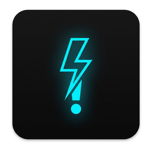

<div align="center">
  
  <h1>Flick</h1>
  <p><strong>Write, dictate, and reply from anywhere—on your terms.</strong></p>
  <p>
    <a href="https://rixabhh.github.io/flick/"></a>
    <a href="https://v2.tauri.app/"></a>
    <a href="https://svelte.dev/"></a>
    <a href="LICENSE"></a>
  </p>
</div>

Flick is a local-first desktop writing assistant for Windows, macOS, and Linux. Transform text in place, dictate with a local model or an explicitly configured cloud provider, and draft thoughtful replies from an intentional text selection. Bring your own AI provider and decide where transcription runs.

> **Beta status:** Stable promotion requires signed/notarized per-platform builds and native acceptance evidence. macOS candidates require macOS 11 or later. See [MARKET_READY_PLAN.md](MARKET_READY_PLAN.md) and [RELEASE_CHECKLIST.md](RELEASE_CHECKLIST.md).

## What Flick does

- **Write anywhere:** Type `!fix`, `!formal`, `!translate:spanish`, or a custom command in a text field. Flick replaces the current text using your configured provider.
- **Draft replies deliberately:** Select only the context you want, choose a tone, provide a rough instruction, then edit, copy, or explicitly insert the result.
- **Dictate your way:** Record through a chosen microphone with adaptive voice-activity detection, then use local Whisper, Parakeet, Canary, Qwen3 ASR, SenseVoice, or Moonshine models—or explicitly opt into an OpenAI-compatible cloud transcription endpoint.
- **Keep control:** Configure shortcuts, exclusions, plain-text paste, command templates, optional history, diagnostics export, and English/Spanish UI.

## Quick start

1. Open **Settings → Write**, select Gemini, OpenRouter, or an OpenAI-compatible endpoint, then save your own key. Local compatible endpoints may omit a key.
2. Open **Models** and download a verified local speech model. Flick shows the engine, disk size, languages, auto-detection, and translation capability before you choose. If you prefer cloud dictation, select the cloud provider under **Dictate**, set its endpoint/model, and save its separate API key.
3. Open **Dictate** and choose a microphone plus Toggle, Push-to-talk, or Hold-or-toggle activation.
4. Use Flick in a supported text field:
   - Type text followed by a `!command`.
   - Select conversation text and open the reply composer.
   - Press the dictation shortcut to record locally.

The default reply shortcut is `Ctrl+Shift+Space` and dictation shortcut is `Ctrl+Space` on Windows/Linux; macOS uses `Cmd` in place of `Ctrl`.

### Install the right build

On the release page, choose the file that matches both your operating system and processor. Windows names are intentional: use **`x64`** for the vast majority of Intel/AMD PCs and **`arm64`** only for Windows on ARM devices such as Snapdragon PCs. An `x64` MSI cannot install on Windows ARM; download the matching `arm64` MSI (or `arm64-setup.exe`) instead. macOS builds are published separately for **Apple Silicon** and **Intel**.

## Your first day with Flick

Flick is designed to stay invisible until you call it. You do not need to learn a new editor or move your work into a separate window.

| If you want to… | Do this | What happens next |
| --- | --- | --- |
| Improve a sentence | Add `!fix` at the end of the sentence | Flick replaces that text in the app you are already using. |
| Send a considered reply | Select the relevant message, press the reply shortcut, choose a tone, and state your intent | Review the editable draft, then Copy or explicitly Insert it. |
| Write without typing | Press the dictation shortcut, speak, then press it again (or release it in push-to-talk mode) | Flick transcribes locally and safely pastes the result only if the original field is still active. |

Start with `!fix`, **Casual** replies, and the **Tiny English** model. They are the quickest way to learn the flow. Move to a larger or multilingual model only when you need more accuracy or languages; the Models page displays each download’s disk size before you choose it.

### If something does not work

- **No dictation:** Download a model, then select the correct microphone in **Dictate**. Approve the OS microphone permission when it appears.
- **Nothing is pasted:** Flick deliberately refuses to paste into protected fields or after the target app changes. The result remains available to copy.
- **Shortcut is ignored:** Change it under **Advanced**, or on restricted Wayland desktops bind a desktop shortcut to the documented Flick CLI action.
- **Model download stopped:** Use Download again. Flick resumes only when the model server confirms the byte range, and validates the complete file before it appears as installed.
- **AI generation is unavailable:** Check the provider/key in **Write**. Local OpenAI-compatible servers can be configured without a key.

## Write with commands

| Command | Result |
| --- | --- |
| `!fix` | Correct grammar, spelling, and punctuation. |
| `!formal` / `!casual` | Adjust professional or friendly tone. |
| `!shorter` / `!longer` | Condense or expand text. |
| `!rephrase` | Say the same thing more clearly. |
| `!bullet` / `!explain` | Structure notes or simplify dense text. |
| `!translate:<language>` | Translate to the named language. |

Create custom commands in **Settings → Commands**. Template import/export is local and includes only triggers and prompts—never keys, drafts, history, or recordings.

## Reply composer

Flick never automatically inspects the screen, chat history, or accessibility tree. It captures only an explicit text selection, restores the clipboard, and opens a compact draft window.

1. Select the message(s) to reference.
2. Open the composer, choose a tone, and describe the response.
3. Generate and edit the draft.
4. Choose **Copy** or explicitly confirm **Insert into app**.

Context is treated as untrusted prompt data and is sent only when you choose **Generate**. Flick verifies the original target before insertion; on target change, protected fields, or paste failure, the draft remains available to copy.

## Dictation, local models, and optional cloud transcription

Dictation records locally, resamples on-device, applies adaptive voice-activity detection, and can clean filler words or apply personal corrections. Press `Escape` during recording to discard it without transcription, history, or paste-back. The transcription pill can be placed at the bottom-center, bottom-left, bottom-right, or top-center of your display from **Settings → Dictate**.

The local catalog includes English-focused and multilingual Whisper tiers, Parakeet TDT 0.6B v3, Canary 180M Flash, Qwen3-ASR 0.6B, SenseVoice Small, and Moonshine Tiny. Each GGUF artifact comes from a pinned Hugging Face revision; it streams to `.partial`, resumes only on confirmed byte ranges, verifies SHA-256, and is atomically installed only after verification. The settings UI disables languages, automatic detection, and translation that the selected model does not support. Compatible user-supplied Whisper `.bin` and GGUF files are discovered locally and never uploaded.

Cloud transcription is strictly opt-in. Flick sends audio only after you select the OpenAI-compatible cloud provider, save a distinct transcription API key in your OS keychain, and start dictation. The endpoint must be HTTPS except for a local development server; Flick does not silently fall back from local to cloud. Cloud providers receive the recorded audio and selected language/model only to fulfill that transcription request.

Optional AI cleanup is off by default and sends only the final text transcript—not audio—to the configured provider.

### Linux notes

The recording overlay stays hidden by default on Linux because some X11/Wayland compositors can steal focus and make paste-back unsafe. Flick prefers `xdotool` on X11 and `wtype` (or `dotool`) on Wayland when installed, then falls back to native input. Where Wayland restricts global shortcuts, bind your desktop shortcut to a Flick CLI action.

## Privacy and safety

- **BYOK:** Gemini, OpenRouter, and OpenAI-compatible endpoints communicate directly with the provider you configure.
- **Keychain-backed credentials:** API keys are not stored in the settings JSON file.
- **Selection-only context:** No automatic OCR, screen capture, chat-history collection, or accessibility-tree scraping.
- **Protected-target refusal:** Flick blocks known credential-manager apps and user exclusions. Windows also checks the native password-field flag without reading field contents.
- **Safe insertion:** Dictation, replies, and text transformations verify the original target and restore text clipboard contents after paste transactions. If a transformation finishes after focus changes, Flick refuses the paste and keeps the result available through **Copy last result** for the current session.
- **Local deletion:** Clear history, retained recordings, downloaded models, and stored keys from Settings.
- **No telemetry by default:** Diagnostics export is explicit and redacted; it excludes credentials, clipboard data, drafts, history contents, and prompts.

## Shortcuts and CLI

| Action | Windows / Linux | macOS |
| --- | --- | --- |
| Reply composer | `Ctrl+Shift+Space` | `Cmd+Shift+Space` |
| Dictation | `Ctrl+Space` | `Cmd+Space` |
| Copy last result | `Ctrl+Alt+C` | `Cmd+Alt+C` |
| Paste as plain text | `Ctrl+Alt+V` | `Cmd+Alt+V` |

Desktop environments and external hotkey tools can route a fixed action set to a running Flick instance:

```text
flick --open-settings
flick --open-composer
flick --toggle-dictation
flick --cancel-dictation
flick --copy-last-result
```

Unknown arguments are ignored. The CLI never accepts arbitrary text, prompts, or shell commands.

## Platforms

| Platform | Target | Notes |
| --- | --- | --- |
| Windows | x64, ARM64 | Native password-field protection is available. |
| macOS | Apple Silicon, Intel | Grant microphone/accessibility permissions when prompted. |
| Linux | x64 | X11 is first-class; Wayland may need an input helper and desktop shortcut. |

## Develop and verify

Prerequisites: Node.js 20+, Rust 1.77+, and [Tauri v2 platform prerequisites](https://v2.tauri.app/start/prerequisites/).

```bash
git clone https://github.com/rixabhh/flick.git
cd flick
npm ci
npm run tauri dev

npm test
npm run test:e2e
npm run build
cargo test --manifest-path src-tauri/Cargo.toml
cargo clippy --manifest-path src-tauri/Cargo.toml -- -D warnings
```

The real local-model smoke test is opt-in and needs local model/audio fixtures:

```text
FLICK_WHISPER_MODEL=/path/to/ggml-tiny.en.bin
FLICK_WHISPER_SAMPLE=/path/to/sample.wav
cargo test --manifest-path src-tauri/Cargo.toml transcribes_real_whisper_audio -- --ignored
```

CI verifies frontend, browser UI, and native targets across Windows x64/ARM64, macOS Intel/Apple Silicon, and Linux x64. GitHub-hosted macOS builds use current macOS 15 runners (`macos-15-intel` and `macos-15`) so Intel packaging does not depend on the retired macOS 13 image. Physical hardware, compositor, signing, and notarization checks remain release gates.

Release packaging is separate from Verify and Pages. A manual **build-only** Release run tests the real installers without publishing. Tagged candidates are assembled as drafts only after every platform succeeds, with SHA-256 checksums. Follow the [release procedure](RELEASE_CHECKLIST.md#reproducible-build-and-draft-process); do not use `main` as a release tag.

## Project structure

- `src-tauri/src/` — Rust services for input, dictation, models, history, providers, diagnostics, and native integration.
- `src/lib/` — Svelte command center, composer, overlay, models, history, and UI helpers.
- `.github/workflows/` — verification and draft-release workflows.
- `CHANGELOG.md` — beta release notes.
- `RELEASE_CHECKLIST.md` — signing and promotion checklist.

## License

Flick is available under the [MIT License](LICENSE).
