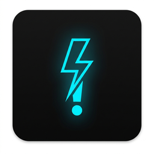

<div align="center">
  
  <h1>Flick</h1>
  <p><strong>Stay in flow. Say it better.</strong></p>
  <p>A private desktop writing companion for transforming text, drafting replies, and dictating where you already work.</p>
  <p>
    <a href="https://rixabhh.github.io/flick/">Website</a> ·
    <a href="https://github.com/rixabhh/flick/releases">Downloads</a> ·
    <a href="#quick-start">Quick start</a> ·
    <a href="#privacy">Privacy</a>
  </p>
</div>

Flick is not another document editor or chat tab. It appears only when you invoke a command or shortcut, uses the text you deliberately select, and gives you the final say before anything is inserted.

> **Release status:** Flick 2.0.1 is a release candidate. The available Windows installers are **unsigned**, and macOS release builds require Developer ID signing and notarization. Do not treat a candidate as a certified public release; see the [release checklist](RELEASE_CHECKLIST.md).

## What Flick helps with

| When you need to… | Use Flick to… |
| --- | --- |
| Tighten a message | Add `!fix`, `!formal`, `!shorter`, or a custom command after the text. |
| Answer thoughtfully | Select the relevant message, trigger Reply, choose a tone, then edit the draft. |
| Keep typing hands-free | Trigger Dictation, speak, and let your selected model return text to the original field. |

## Quick start

### 1. Install and allow the required permissions

Download the candidate that matches your machine from [GitHub Releases](https://github.com/rixabhh/flick/releases). When the operating system asks, grant microphone access for dictation and the accessibility/input permission needed for global shortcuts and safe text insertion.

Candidate download names use the target architecture:

- **Windows:** `x64` for most Intel/AMD PCs; `arm64` for Windows on ARM.
- **macOS:** `aarch64` for Apple Silicon; `x64` for Intel Macs.
- **Linux:** x64 packages for the supported desktop session.

### 2. Pick one workflow to try

**Transform text**

1. Type normally in an app you already use.
2. Append a command, for example: `could you send the notes today !formal`.
3. Flick replaces the command and source text only after the configured provider returns a result.

**Draft a reply**

1. Select exactly the message that should become context.
2. Press the Reply shortcut (default: `Ctrl+Shift+Space` on Windows/Linux, `Cmd+Shift+Space` on macOS).
3. Choose a visible tone, add your intent, and generate a draft.
4. Edit it, then choose **Copy** or **Insert**.

**Dictate**

1. Focus a normal text field.
2. Press the Dictation shortcut (default: `Ctrl+Space` on Windows/Linux, `Cmd+Space` on macOS).
3. Wait for the small rounded recording pill, then speak.
4. Press the shortcut again to finish, or press `Esc` to discard.

## Make Flick yours

Open **Settings** to:

- choose a local speech model or explicitly configure an OpenAI-compatible cloud transcription provider;
- record shortcuts that do not conflict with your other Flick actions;
- create custom transform commands;
- choose the placement of compact status pills; and
- review history, diagnostics, model downloads, and safety settings.

Flick rejects duplicate or reserved copy/paste shortcuts. If the focused app changes while it is working, Flick does not paste into the new target; use **Copy last result** instead.

## Commands

| Command | What it does |
| --- | --- |
| `!fix` | Correct grammar, spelling, and punctuation. |
| `!formal` | Make wording more professional. |
| `!casual` | Make wording more relaxed. |
| `!shorter` | Make the writing concise. |
| `!longer` | Add useful detail. |
| `!rephrase` | Express the same idea more clearly. |
| `!bullet` | Turn text into a list. |
| `!translate:spanish` | Translate into the language you name. |

Create custom commands in **Settings → Commands**.

## Privacy

- Reply uses only the selection you trigger it with; it does not scan whole conversations.
- Local dictation keeps audio on the device.
- Cloud transcription is opt-in and uses only the provider and key you configure.
- API keys are stored in the operating-system keychain.
- Flick avoids protected password fields and refuses uncertain or changed paste targets.
- Recordings and history are optional, and can be removed in Settings.
- Flick has no telemetry by default.

## Troubleshooting

- **No recording starts:** allow microphone access, then check the selected input under **Settings → Dictate**.
- **A shortcut does nothing:** record it again in Settings; avoid operating-system reserved shortcuts.
- **The result was not inserted:** Flick protects a changed or protected target. Use **Copy last result** and paste it yourself.
- **A model download failed:** retry it from **Models**. Flick verifies downloaded files before they become available.
- **A reply has no context:** select the message before invoking the Reply shortcut, then retry from the original app.

For a reproducible bug report, export redacted diagnostics from Settings and attach them to a [GitHub issue](https://github.com/rixabhh/flick/issues). Never include API keys, private messages, recordings, or transcripts.

## Development

Requires Node.js 20+, Rust 1.77+, and the [Tauri v2 prerequisites](https://v2.tauri.app/start/prerequisites/).

```bash
git clone https://github.com/rixabhh/flick.git
cd flick
npm ci
npm run tauri dev

npm test
npm run test:e2e
npm run build
cargo test --locked --manifest-path src-tauri/Cargo.toml
```

Repository map:

- `src-tauri/src/` — Rust services, speech, shortcuts, clipboard safety, and native integration.
- `src/lib/` — Svelte settings, reply composer, overlays, and interface helpers.
- `docs/` — the deployed GitHub Pages product site.
- `.github/workflows/` — verification, signing, notarization, and release automation.
- `RELEASE_CHECKLIST.md` — mandatory signing, device validation, and promotion gates.

## License

Flick is available under the [MIT License](LICENSE). Speech models retain their upstream licenses, which Flick links from the Models screen.
